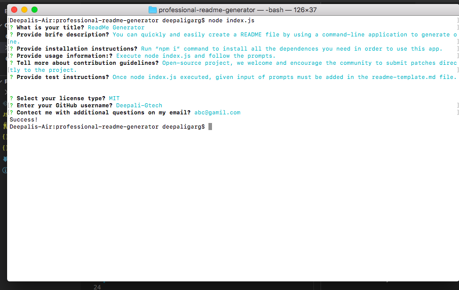
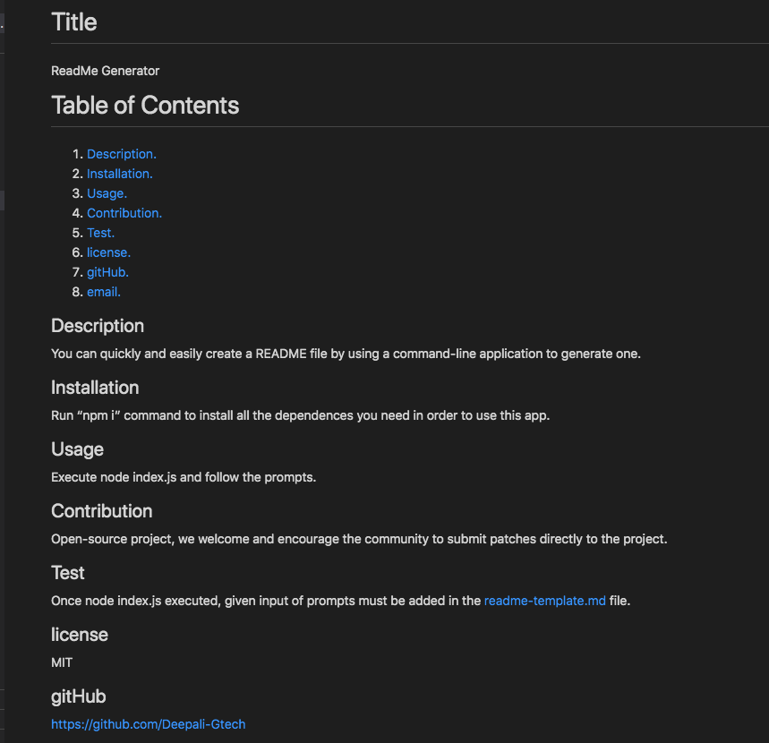

# professional-readme-generator
This app will create a command-line application that dynamically generates a professional README.md file from a user's input using the Inquirer package.

# walkthrough video link 

walkthrough video: https://deepali-gtech.github.io/weather_dashboard

## Below is the screen short for terminal

## Below is the screen short for the created README file

## Technologies used
* Node.js

## License 
* MIT

### Contact Detail 
Email-Id : deeapaligarg.chd@gmail.com

